SpringBoot

# 入门前置

### 配置pom.xml

```xml
<?xml version="1.0" encoding="UTF-8"?>
<project xmlns="http://maven.apache.org/POM/4.0.0"
         xmlns:xsi="http://www.w3.org/2001/XMLSchema-instance"
         xsi:schemaLocation="http://maven.apache.org/POM/4.0.0 http://maven.apache.org/xsd/maven-4.0.0.xsd">
    <modelVersion>4.0.0</modelVersion>

    <groupId>org.example</groupId>
    <artifactId>HelloWord</artifactId>
    <version>1.0-SNAPSHOT</version>

    <properties>
        <maven.compiler.source>16</maven.compiler.source>
        <maven.compiler.target>16</maven.compiler.target>
    </properties>

    <parent>
        <groupId>org.springframework.boot</groupId>
        <artifactId>spring-boot-starter-parent</artifactId>
        <version>2.6.7</version>
        <relativePath/> <!-- lookup parent from repository -->
    </parent>

    <dependencies>
        <dependency>
            <groupId>org.springframework.boot</groupId>
            <artifactId>spring-boot-starter-web</artifactId>
        </dependency>
    </dependencies>

    <!-- 打包时配置main入口 -->
     <build>
        <plugins>
            <plugin>
                <groupId>org.springframework.boot</groupId>
                <artifactId>spring-boot-maven-plugin</artifactId>
                <version>2.6.6</version>
            </plugin>
        </plugins>
    </build>
</project>
```

### 建包并创建控制器@RestController

```java
package com.huhuhux.controller;

import org.springframework.web.bind.annotation.RequestMapping;
import org.springframework.web.bind.annotation.ResponseBody;
import org.springframework.web.bind.annotation.RestController;

@RestController
@RequestMapping("/hello")
public class HelloController {

    @RequestMapping("/word")
    @ResponseBody
    public String helloWord(){
        return "HelloWord";
    }

}
```

### 配置main入口

```java
package com.huhuhux;

import org.springframework.boot.SpringApplication;
import org.springframework.boot.autoconfigure.SpringBootApplication;

@SpringBootApplication
public class Application {
    public static void main(String[] args) {
        SpringApplication.run(Application.class,args);
    }
}
```

### 配置aoolication.porperties修改端口

```porperties
server.port=8080
server.servlet.context-path=/huhuhux
```


### 打包时打成jar包就行

# @Configuration ,bean工厂详解,以前的applicationContext.xml

```java
package com.huhuhux.config;

import com.huhuhux.pojo.Pet;
import com.huhuhux.pojo.User;
import org.springframework.context.annotation.Bean;
import org.springframework.context.annotation.Configuration;

/**
 * @Bean给对象加上组件默认模板看下
 * 其中加了@Configuration后,该类也成为了一个组件
 * 也就是说@Configuration代替了ApplicationContexet.xml
 * 其中当proxyBeanMethods设置为false时
 * 外部调用方法与工厂中的对象不一致
 * 也就是说如果一以后别要调用容器中的对象,可以直接调用方法拿到容器中的对象
 * 一般将proxyBeanMethods设置为false
 * 
 */
@Configuration(proxyBeanMethods = true)
public class MyConfig {

    @Bean
    public User user01(){

        User user = new User("张三", 18,new Pet("ton"));
        return user;
    }

    @Bean("tom")
    public Pet pet01(){
        return new Pet("tomcat");
    }

}
```

## @Impor,通过类加载器添加组件

```java
package com.huhuhux.config;

import ch.qos.logback.core.encoder.ByteArrayUtil;
import com.huhuhux.pojo.Pet;
import com.huhuhux.pojo.User;
import org.springframework.context.annotation.Bean;
import org.springframework.context.annotation.Configuration;
import org.springframework.context.annotation.Import;

/**
 *
 * @Import可以通过类加载器添加组件,不需要注册你要添加的组件
 */
@Import({User.class, ByteArrayUtil.class})
@Configuration(proxyBeanMethods = true)
public class MyConfig {

    @Bean
    public User user01(){

        User user = new User("张三", 18);
        user.getPet();
        return user;
    }

    @Bean("tom")
    public Pet pet01(){
        return new Pet("tomcat");
    }

}

```

## @ConditionalOnBean() 条件装配

```java
 * @ConditionalOnBean(name = "tom")
 * 条件装配,为是否装配添加前置条件
 */
@Import({User.class, ByteArrayUtil.class})
@Configuration(proxyBeanMethods = true)
@ConditionalOnBean(name = "tom")
public class MyConfig {

    @ConditionalOnBean(name = "tom")
    @Bean
    public User user01(){

        User user = new User("张三", 18);
        user.getPet();
        return user;
    }
```

## @ImportResource("classpath:applicationContext.xml")导入外部配置文件

```java
@Import({User.class, ByteArrayUtil.class})
@Configuration(proxyBeanMethods = true)
@ConditionalOnBean(name = "tom")
@ImportResource("classpath:applicationContext.xml")
public class MyConfig {
```

## @Component直接将实体类添加为容器组件

```java
@Component
public class Pet {
    private String name;
```

## @ConfigurationProperties从配置文件中导入配置,从而自动装配

```
@Component
@ConfigurationProperties(prefix = "mycar")
public class Car {
    private String brand;
    private int price;
```

也可以不用添加@Component,在使用的类中添加装配,从而导入配置文件

```java
@EnableConfigurationProperties(Car.class)
public class HelloController {

    @Autowired
    Car car;
```

```porperties
server.port=8082

mycar.brand=BYD
mycar.price=10000
```

# 最佳实践

- 引入场景依赖
    - 官方文档
- 查看自动配置了哪些（选做）
    - 自己分析，引入场景对应的自动配置一般都生效了
      配置文件中debug=true开启自动配置报告。
        - Negative（不生效）
        - Positive（生效）
- 是否需要修改
    - 参照文档修改配置项
        - 官方文档
        - 自己分析。xxxxProperties绑定了配置文件的哪些。
    - 自定义加入或者替换组件
        - @Bean、@Component…
          自定义器 XXXXXCustomizer；
          …

# Lombok

```xml
 <dependency>
     <groupId>org.projectlombok</groupId>
     <artifactId>lombok</artifactId>
</dependency>
```

### 简化pojo

```java
package com.huhuhux.pojo;

import lombok.AllArgsConstructor;
import lombok.Data;
import lombok.NoArgsConstructor;
import lombok.ToString;

//gat and set
@Data
@ToString
@NoArgsConstructor
public class User {
    private String name;
    private  int age;

    private Pet pet;

    public User(String name,int age){
        this.name=name;
        this.age=age;
    }

}
```

### 添加日志@Slf4j

```java
@Slf4j
@RestController
@RequestMapping("/hello")
public class HelloController {

    @Autowired
    Car car;

    @RequestMapping("/word")
    @ResponseBody
    public String helloWord(){
        log.info("Hallo进来了..............");
        return "HelloWord";
    }
```


## 热更新devtools 添加后ctrl+f9

```xml
			 <dependency>
                <groupId>org.springframework.boot</groupId>
                <artifactId>spring-boot-devtools</artifactId>
                <optional>true</optional>
            </dependency>
```


# YAML 配置springboot

## 依赖

```xml
		<dependency>
            <groupId>org.springframework.boot</groupId>
            <artifactId>spring-boot-configuration-processor</artifactId>
            <optional>true</optional>
        </dependency>
```

## appliaction.yml(必须要叫这个)优先application.porperties

```yml
person:
  userName: 胡佳纬
  boss: true
  birth: 2022/08/01
  age: 18
  pet:
    name: 小花
    weight: 11.1
  interests:
    - 100
    - 200
    - 300
  animal:
    - 321
    - 123
    - 456
  score:
    huhux: 胡佳纬
    uxuxux: 伟加胡
  salarys:
    - 1111
    - 22222

```

## pojo

```java
package com.huhuhux.bean;

import lombok.Data;
import lombok.NoArgsConstructor;
import lombok.ToString;
import org.springframework.boot.autoconfigure.SpringBootApplication;
import org.springframework.boot.context.properties.ConfigurationProperties;
import org.springframework.stereotype.Controller;

import java.util.Date;
import java.util.List;
import java.util.Map;
import java.util.Set;

@Data
@Controller
@ToString
@ConfigurationProperties(prefix = "person")
public class Person {
    public Person() {
    }

    private String userName;
    private Boolean boss;
    private Date birth;
    private Integer age;
    private Pet pet;
    private String[] interests;
    private List<String> animal;
    private Map<String, Object> score;
    private Set<Double> salarys;
    private Map<String, List<Pet>> allPets;

}

```

## 小知识点


## ${资源全限定名}拿取资源

```yml
username:
  xing: 胡
  ming: 佳伟
  name: ${username.xing}${username.ming}
```

```java
   @Value("${username.nianling}")
    private String age;
```

## ""使用""抱箍的字符可以进行转译

### 从processor导入数据的勾八提示

```xml
		<dependency>
            <groupId>org.springframework.boot</groupId>
            <artifactId>spring-boot-configuration-processor</artifactId>
            <optional>true</optional>
        </dependency>
```

```xml
 <build>
        <plugins>
            <plugin>
                <groupId>org.springframework.boot</groupId>
                <artifactId>spring-boot-maven-plugin</artifactId>
                    <!--不要把这个提示打包进来-->
                <configuration>
                    <excludes>
                        <exclude>
                            <groupId>org.springframework.boot</groupId>
                            <artifactId>spring-boot-configuration-processor</artifactId>
                        </exclude>
                    </excludes>
                </configuration>
            </plugin>
        </plugins>
    </build>
```


# 静态资源的访问

## 静态资源目录

只要静态资源放在一下目录下,只需要 http://localhost:8080/ +资源全限定名就可以访问静态资源

- 原理： 静态映射/**。

**前提controller中没有与资源名相同的访问路径**

请求进来，先去找Controller看能不能处理。不能处理的所有请求又都交给静态资源处理器。静态资源也找不到则响应404页面。

也可以改变默认的静态资源路径，`/static`，`/public`,`/resources`, `/META-INF/resources`失效


## 改变静态资源前置路径

```yml
spring:
  mvc:
    static-path-pattern: /res/**
```


## 指定资源放置路径

```yml
spring:
  web:
    resources:
      static-locations: [ classpath:/haha/]
```

## 添加index主页

在resouerces/static目录下添加index.html,访问http://localhost:8080/可以直接访问该idenx.html


but,不能改变静态资源前置路径,要不然会失效

```yml
#spring:
#  mvc:
#    static-path-pattern: /res/**
```

## 设置网页图标

将favicon.ico放在static目录下即可


​	

# Spring整合Junit

测试类必须要和main入口类在同一目录名下

## 但是可以配置引导类

```java
@SpringBootTest(classes = SpringBoot001Application.class)
class SpringBoot001ApplicationTests {

```

# Spring整合MyBatis

## 导入maven


### application.yaml

```yml
spring:
  datasource:
    driver-class-name: com.mysql.cj.jdbc.Driver
    url: jdbc:mysql://localhost:3306/ssm?serverTimezone=UTC
    username: root
    password: root
```

### Student类

```java
package com.huhuhux.pojo;


import lombok.AllArgsConstructor;
import lombok.Data;
import lombok.NoArgsConstructor;
import lombok.ToString;

@ToString
@Data
@NoArgsConstructor
@AllArgsConstructor
public class Student {
    private Integer id;
    private String name;
    private Integer age;
    private String home;
    private Integer number;
}
```

### StudentMapper

```java
package com.huhuhux.mapper;

import com.huhuhux.pojo.Student;
import org.apache.ibatis.annotations.Mapper;
import org.apache.ibatis.annotations.Select;

@Mapper
public interface StudentMapper {

    @Select("select * from student where id=#{id}")
    public Student getById(Integer id);
}
```

### 运行

```java
package com.huhuhux;

import com.huhuhux.mapper.StudentMapper;
import com.huhuhux.mapper.UserMapper;
import org.junit.jupiter.api.Test;
import org.springframework.beans.factory.annotation.Autowired;
import org.springframework.boot.test.context.SpringBootTest;

import java.util.List;

@SpringBootTest
class SpringBootMybatis001ApplicationTests {

    @Autowired
    UserMapper userMapper;

    @Autowired
    StudentMapper studentMapper;

    @Test
    void contextLoads() {

        System.out.println(studentMapper.getById(12));
        
    }

}
```

## 常见问题处理

### mySql低版本时区问题

```yml
 url: jdbc:mysql://localhost:3306/ssm?serverTimezone=UTC
```

## 驱动类name问题

```yml
driver-class-name: com.mysql.cj.jdbc.Driver
```

## 整合MyBatis-Plus

### 不用写xxxMapper接口的繁琐的查询类了

#### prm.xml

```xml
		<dependency>
            <groupId>com.baomidou</groupId>
            <artifactId>mybatis-plus-boot-starter</artifactId>
            <version>3.4.2</version>
        </dependency>
```

```java
package com.huhuhux.mapper;

import com.baomidou.mybatisplus.core.mapper.BaseMapper;
import com.huhuhux.pojo.Student;
import org.apache.ibatis.annotations.Mapper;
import org.apache.ibatis.annotations.Select;

@Mapper
public interface StudentMapper extends BaseMapper<Student> {

}
```

## 表找不到怎么办

### @TableName()

```java
@TableName("student")
public class Student {
    private Integer id;
    private String name;
    private Integer age;
    private String home;
    private Integer number;
}
```

### 配置里加名称前缀

```yml
mybatis-plus:
  global-config:
    db-config:
      table-prefix: **_
```

## 整合Druid数据源

#### pro.xml

```xml
  <dependency>
            <groupId>com.alibaba</groupId>
            <artifactId>druid-spring-boot-starter</artifactId>
            <version>1.2.3</version>
        </dependency>
```

#### application.yml配置数据源

```yml
spring:
  datasource:
    druid:
      driver-class-name: com.mysql.cj.jdbc.Driver
      url: jdbc:mysql://localhost:3306/ssm?serverTimezone=UTC
      username: root
      password: root
```

或者

```yml
spring:
  datasource:
    driver-class-name: com.mysql.cj.jdbc.Driver
    url: jdbc:mysql://localhost:3306/ssm?serverTimezone=UTC
    username: root
    password: root
    type: com.alibaba.druid.pool.DruidDataSource
```

# 整合总结


# SSMP

## 创建springboot项目,配置pom

```xml
<?xml version="1.0" encoding="UTF-8"?>
<project xmlns="http://maven.apache.org/POM/4.0.0" xmlns:xsi="http://www.w3.org/2001/XMLSchema-instance"
         xsi:schemaLocation="http://maven.apache.org/POM/4.0.0 https://maven.apache.org/xsd/maven-4.0.0.xsd">
    <modelVersion>4.0.0</modelVersion>
    <groupId>com.huhuhu</groupId>
    <artifactId>SpringBoot_ssmt</artifactId>
    <version>0.0.1-SNAPSHOT</version>
    <name>SpringBoot_ssmt</name>
    <description>SpringBoot_ssmt</description>

    <properties>
        <java.version>1.8</java.version>
        <project.build.sourceEncoding>UTF-8</project.build.sourceEncoding>
        <project.reporting.outputEncoding>UTF-8</project.reporting.outputEncoding>
        <spring-boot.version>2.3.7.RELEASE</spring-boot.version>
    </properties>

    <dependencies>


        <dependency>
            <groupId>org.springframework.boot</groupId>
            <artifactId>spring-boot-starter-web</artifactId>
        </dependency>

        <dependency>
            <groupId>mysql</groupId>
            <artifactId>mysql-connector-java</artifactId>
            <scope>runtime</scope>
        </dependency>

        <dependency>
            <groupId>com.alibaba</groupId>
            <artifactId>druid-spring-boot-starter</artifactId>
            <version>1.2.3</version>
        </dependency>

        <dependency>
            <groupId>com.baomidou</groupId>
            <artifactId>mybatis-plus-boot-starter</artifactId>
            <version>3.4.2</version>
        </dependency>

        <dependency>
            <groupId>org.projectlombok</groupId>
            <artifactId>lombok</artifactId>
        </dependency>

        <dependency>
            <groupId>org.springframework.boot</groupId>
            <artifactId>spring-boot-starter-test</artifactId>
            <scope>test</scope>
            <exclusions>
                <exclusion>
                    <groupId>org.junit.vintage</groupId>
                    <artifactId>junit-vintage-engine</artifactId>
                </exclusion>
            </exclusions>
        </dependency>
    </dependencies>

    <dependencyManagement>
        <dependencies>
            <dependency>
                <groupId>org.springframework.boot</groupId>
                <artifactId>spring-boot-dependencies</artifactId>
                <version>${spring-boot.version}</version>
                <type>pom</type>
                <scope>import</scope>
            </dependency>
        </dependencies>
    </dependencyManagement>

    <build>
        <plugins>
            <plugin>
                <groupId>org.apache.maven.plugins</groupId>
                <artifactId>maven-compiler-plugin</artifactId>
                <version>3.8.1</version>
                <configuration>
                    <source>1.8</source>
                    <target>1.8</target>
                    <encoding>UTF-8</encoding>
                </configuration>
            </plugin>
            <plugin>
                <groupId>org.springframework.boot</groupId>
                <artifactId>spring-boot-maven-plugin</artifactId>
                <version>2.3.7.RELEASE</version>
                <configuration>
                    <mainClass>com.huhuhu.SpringBootSsmtApplication</mainClass>
                </configuration>
                <executions>
                    <execution>
                        <id>repackage</id>
                        <goals>
                            <goal>repackage</goal>
                        </goals>
                    </execution>
                </executions>
            </plugin>
        </plugins>
    </build>

</project>

```

## 含有lombok的实体类

```java
package com.huhuhu.pojo;


import com.baomidou.mybatisplus.annotation.TableName;
import lombok.AllArgsConstructor;
import lombok.Data;
import lombok.NoArgsConstructor;
import lombok.ToString;

@ToString
@Data
@NoArgsConstructor
@AllArgsConstructor
@TableName("student")
public class Student {
    private Integer id;
    private String name;
    private Integer age;
    private String home;
    private Integer number;
}
```

## 配置含有mp的mapper

```java
package com.huhuhu.mapper;

import com.baomidou.mybatisplus.core.mapper.BaseMapper;
import com.huhuhu.pojo.Student;
import org.apache.ibatis.annotations.Mapper;
import org.apache.ibatis.annotations.Select;

import java.util.List;

import static net.sf.jsqlparser.parser.feature.Feature.select;

@Mapper
public interface StudentMapper extends BaseMapper<Student> {
    @Select("select * from student")
    List<Student> selectAll();
}
```

# mp开启日志

```yml
spring:
  datasource:
    druid:
      driver-class-name: com.mysql.cj.jdbc.Driver
      url: jdbc:mysql://localhost:3306/ssm?serverTimezone=UTC
      username: root
      password: root
      type: com.alibaba.druid.pool.DruidDataSource

#mybatis的相关配置
mybatis-plus:
  global-config:
    db-config:
      table-prefix: user_
      # 设置数据库主键自增
      id-type: auto
  # 开启日志    
  configuration:
    log-impl: org.apache.ibatis.logging.stdout.StdOutImpl
```

开启日志效果

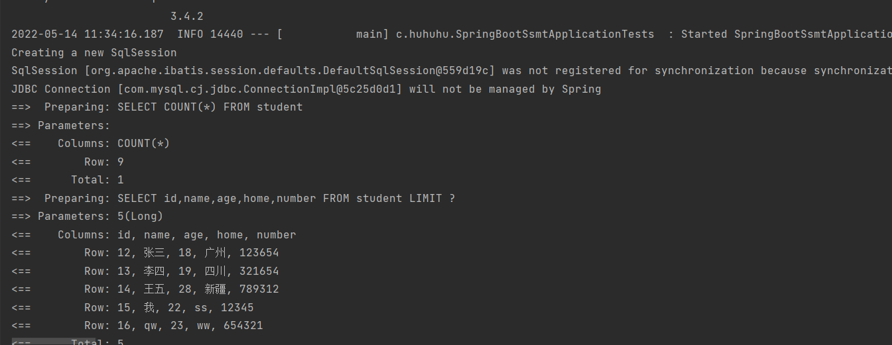

# mp分页

## 首先要配置,添加一个mp的拦截器

```java
package com.huhuhu.Config;

import com.baomidou.mybatisplus.extension.plugins.MybatisPlusInterceptor;
import com.baomidou.mybatisplus.extension.plugins.inner.PaginationInnerInterceptor;
import org.springframework.context.annotation.Bean;
import org.springframework.context.annotation.Configuration;

@Configuration
public class MPConfig {
    @Bean
    public MybatisPlusInterceptor mybatisPlusInterceptor(){
        MybatisPlusInterceptor interceptor = new MybatisPlusInterceptor();
        interceptor.addInnerInterceptor(new PaginationInnerInterceptor());
        return interceptor;
    }
}
```

## 使用时要用page对象来编写分页条件

```java
package com.huhuhu;

import com.baomidou.mybatisplus.core.metadata.IPage;
import com.baomidou.mybatisplus.extension.plugins.pagination.Page;
import com.huhuhu.mapper.StudentMapper;
import com.huhuhu.mapper.UserMapper;
import org.junit.jupiter.api.Test;
import org.springframework.beans.factory.annotation.Autowired;
import org.springframework.boot.test.context.SpringBootTest;

@SpringBootTest
class SpringBootSsmtApplicationTests {
    
    @Autowired
    StudentMapper studentMapper;

    @Test
    void contextLoads() {
    }
    

    @Test
    void selectPage(){
        //
        IPage page = new Page(0,5);
        studentMapper.selectPage(page,null);
        // 下面是page的一些属性
        System.out.println(page.getPages());
        System.out.println(page.getCurrent());
        System.out.println(page.getSize());
        System.out.println(page.getTotal());
        System.out.println(page.getRecords());
    }
}
```

## 效果

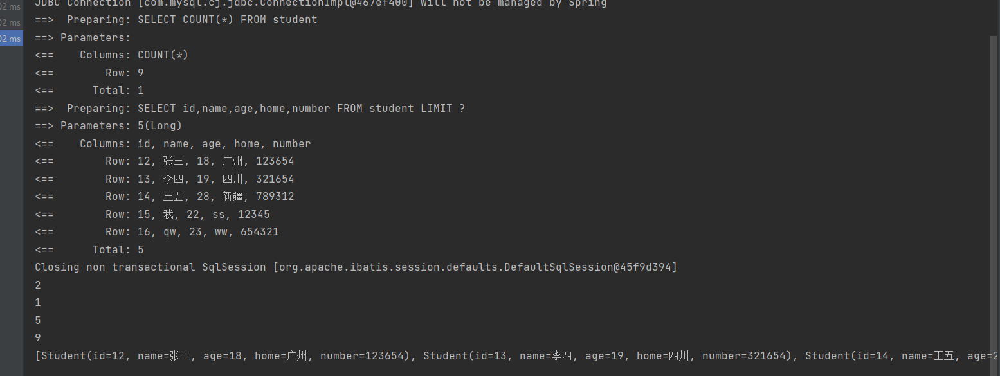

# mp条件查询

## 运行

```java
@Test
    void testGetBy(){
        String name="1";
        //用LambdaQueryWrapper对象存放查询条件
        LambdaQueryWrapper<Student> lqw = new LambdaQueryWrapper<>();
        //lqw.like(是否查询,查询什么,查询数值)
        //if(name != null) lqw.like(Student::getName,name);
        lqw.like(name!=null,Student::getNumber,name);
        studentMapper.selectList(lqw);
        
        //查询分页
        IPage page = new Page(0,5);
        studentMapper.selectPage(page,null);
        System.out.println( studentMapper.selectPage(page,lqw));
    }
```

# 业务层标准开发

## mapper基于mp

StudentMapper

```java
package com.huhuhu.mapper;

import com.baomidou.mybatisplus.core.mapper.BaseMapper;
import com.huhuhu.pojo.Student;
import org.apache.ibatis.annotations.Mapper;


@Mapper
public interface StudentMapper extends BaseMapper<Student> {

}

```

## service

StudentService

```java
package com.huhuhu.service;

import com.baomidou.mybatisplus.core.metadata.IPage;
import com.huhuhu.pojo.Student;

import java.util.List;

public interface StudentService {
    Boolean init(Student student);
    Boolean deleteById(Integer id);
    Boolean updateById(Student student);
    List<Student> selectAll();
    Student selectById(Integer id);
    IPage<Student> getPage(int currentPage,int pageSize);
}

```

StudentServiceImpl

```java
package com.huhuhu.service.impl;

import com.baomidou.mybatisplus.core.metadata.IPage;
import com.baomidou.mybatisplus.extension.plugins.pagination.Page;
import com.huhuhu.mapper.StudentMapper;
import com.huhuhu.pojo.Student;
import com.huhuhu.service.StudentService;
import org.springframework.beans.factory.annotation.Autowired;
import org.springframework.stereotype.Service;

import java.util.List;

@Service
public class StudentServiceImpl implements StudentService {

    private StudentMapper studentMapper;

    @Autowired
    public void setStudentMapper(StudentMapper studentMapper){
        this.studentMapper=studentMapper;
    }

    @Override //增加数据
    public Boolean init(Student student) {
        return studentMapper.insert(student)> 0;
    }

    @Override  //删除数据
    public Boolean deleteById(Integer id) {
        return studentMapper.deleteById(id) > 0;
    }

    @Override //改
    public Boolean updateById(Student student) {
       return studentMapper.updateById(student)>0;
    }

    @Override //查
    public List<Student> selectAll() {
        return studentMapper.selectList(null);
    }

    @Override //id查
    public Student selectById(Integer id) {
        return studentMapper.selectById(id);
    }

    @Override //分页查
    public IPage<Student> getPage(int currentPage, int pageSize) {
        IPage iPage = new Page(currentPage,pageSize);
        return studentMapper.selectPage(iPage,null);//null是查询条件，要用LambdaQueryWrapper对象查询
    }


}

```

## test实现

```java
@Test
    void testGetBy(){
        String name="1";
        //用LambdaQueryWrapper对象存放查询条件
        LambdaQueryWrapper<Student> lqw = new LambdaQueryWrapper<>();
        //lqw.like(是否查询,查询什么,查询数值)
        //if(name != null) lqw.like(Student::getName,name);
        lqw.like(name!=null,Student::getNumber,name);
        studentMapper.selectList(lqw);

        //查询分页
        IPage page = new Page(0,5);
        studentMapper.selectPage(page,null);
        System.out.println( studentMapper.selectPage(page,lqw));
    }

    @Test
    void serviceInit(){
        Student student = new Student();
        student.setId(223234);
        student.setName("测试");
        student.setAge(18);
        student.setNumber(123456);
        student.setHome("xj");
        studentService.init(student);
    }

    @Test
    void deleteById(){
        System.out.println(studentService.deleteById(2233));
    }

    @Test
    void updateById(){
        Student student = new Student();
        student.setId(223234);
        student.setName("测试改");
        student.setAge(182);
        student.setNumber(126);
        student.setHome("gd");
        System.out.println(studentService.updateById(student));
    }

    @Test
    void selectById(){
        System.out.println(studentService.selectById(223234));
    }

    @Test
    void selectAll(){
        System.out.println(studentService.selectAll());
    }

    @Test
    void  getPage(){
        System.out.println(studentService.getPage(1,3));
    }
```

# mybatisplus 简化Service CRUD(增删改查)开发

## 业务层接口

```java
package com.huhuhu.service;

import com.baomidou.mybatisplus.extension.service.IService;
import com.huhuhu.pojo.Student;

//继承IService<T>获取接口中的增删改查方法
public interface IStudentService extends IService<Student> {
}

```

## 业务层接口实现

```java
package com.huhuhu.service.impl;

import com.baomidou.mybatisplus.extension.service.impl.ServiceImpl;
import com.huhuhu.mapper.StudentMapper;
import com.huhuhu.pojo.Student;
import com.huhuhu.service.IStudentService;
import org.springframework.stereotype.Service;

@Service
//业务层实现类要继承ServiceImpl<Mapper,pojo> 和实现类的接口来调用mybatis的增删改查方法
public class StudentServiceImpl extends ServiceImpl<StudentMapper,Student> implements IStudentService {
}

```

## Test

```java
 @Autowired
    StudentServiceImpl service;

    @Test
    //其他也一样可以都可以直接点处理,page()要传入page对象
    void deleteById2(){
        IPage iPage = new Page(1,3);
        service.page(iPage);
    }
```

## 查全部

>使用element的列表显示,dataList绑定列表内数据,dataList对象里的属性再显示

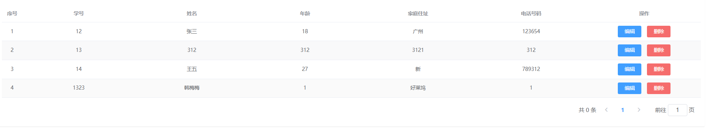

```html
<el-table size="small" current-row-key="id" :data="dataList" stripe highlight-current-row>
									
                <el-table-column type="index" align="center" label="序号"></el-table-column>

                <el-table-column prop="id" label="学号" align="center"></el-table-column>

                <el-table-column prop="name" label="姓名" align="center"></el-table-column>

                <el-table-column prop="age" label="年龄" align="center"></el-table-column>

                <el-table-column prop="home" label="家庭住址" align="center"></el-table-column>

                <el-table-column prop="number" label="电话号码" align="center"></el-table-column>

                <el-table-column label="操作" align="center">

                    <template slot-scope="scope">

                      <el-button type="primary" size="mini" @click="handleUpdate(scope.row)">编辑</el-button>

                       <el-button type="danger" size="mini" @click="handleDelete(scope.row)">删除</el-button>
                    </template>
                </el-table-column>
            </el-table>
```


```js
       //钩子函数，VUE对象初始化完成后自动执行
        created() {
            //调用查询全部数据的操作
            this.getAll();
        },

        methods: {
            //条件查询与分页
            getAll() {
                console.log(123);
                //组织参数，拼接url请求地址
                axios.get("/students").then((res)=>{
                   this.dataList = res.data.data;
                })
            },
```

## 添加

> 弹出表单,初始化表单,发送数据,弹窗,重新刷

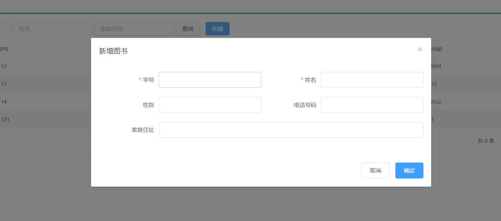

```js
//弹出添加窗口
     handleCreate() {
         //重装表单内数据
         this.formData={}
         //弹出窗口
         this.dialogFormVisible=true;
     },
			//添加
            handleAdd () {
                发送数据
                axios.post("/students",this.formData).then((res)=>{
                    if (res.data.flag){
                        //关闭窗口
                        this.dialogFormVisible=false;
                        //弹窗
                        this.$message.success("添加成功")
                    }else {

                        this.$message.success("添加失败")
                    }
                }).finally(()=>{
                    //重新刷新列表
                    this.getAll();
                });
            },

//取消
cancel(){
    this.dialogFormVisible=false;
    this.dialogFormVisibleEdit=false;
},
```

## 删除


> 先从列表拿数据element中提供的scope.row就是那一行的数据

```html
 <el-button type="danger" size="mini" @click="handleDelete(scope.row)">删除</el-button>
```


```js
 // 删除
            //拿那一行的所有数据
            handleDelete(row) {
                //弹出窗口
                this.$confirm("此操作永久删除当前数据，是否继续？","提示",{
                    //确定和取消
                    type:'info'
                }).then(()=>{
                    //发送delete请求删除
                    axios.delete("/students/"+row.id).then((res)=>{
                        if (res.data.flag){
                            this.$message.success("删除成功")
                        }else {
                            this.$message.success("删除失败")
                        }
                        //无论发送数据成功失败重刷
                    }).finally(()=>{
                        this.getAll();
                    });
                }).catch(()=>{
                    this.$message.info("取消删除操作");
                })
            },
```

## 修改

> 拿数据

```html
            <el-button type="primary" size="mini" @click="handleUpdate(scope.row)">编辑</el-button>
```

> 弹窗,上传

```js
            //修改
            handleEdit() {
                axios.put("/students",this.formData).then((res)=>{
                    if (res.data.flag){
                        this.$message.success("编辑成功")
                        this.dialogFormVisibleEdit=false;
                    }else {
                        this.$message.success("编辑成功")
                    }
                }).finally(()=>{
                    this.getAll();
                });
            }
```

## 异常处理

### 后端

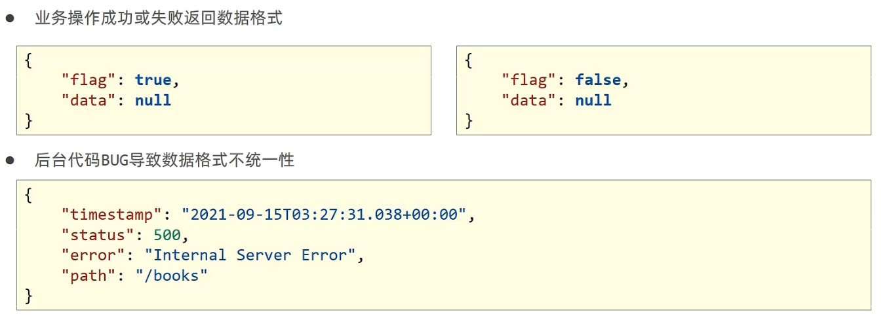

> 后端代码发异常一后,会发出下面那个数据

```java
@PutMapping
    public R updateById(@RequestBody Student student) throws IOException {
        //定义一个异常
        boolean b = studentService.updateById(student);
        return new R(b,null,b?"添加成功":"添加失败");
    }
```

> 声明一个切面用来异常处理

```java
package com.huhuhu.Config;

import com.huhuhu.controller.utils.R;
import org.springframework.web.bind.annotation.ExceptionHandler;
import org.springframework.web.bind.annotation.RestControllerAdvice;

@RestControllerAdvice
public class ProjectExceptionAdvice {

    @ExceptionHandler
    public R doException(Exception ex){
        //记录日志
        //同知运维
        //通知开发

        //控制台打印信息
        ex.printStackTrace();
        
        //给R对象增加一个msg属性
        //统一前端返回格式,异常时发送这个数据
        return new R("服务器故障,请稍后再试!");
    }
}

```

### 前端,统一后端处理异常信息

```js
   //添加
            handleAdd () {
                axios.post("/books",this.formData).then((res)=>{
                    //判断当前操作是否成功
                    if(res.data.flag){
                        //1.关闭弹层
                        this.dialogFormVisible = false;
                        this.$message.success(res.data.msg);
                    }else{
                        this.$message.error(res.data.msg);
                    }
                }).finally(()=>{
                    //2.重新加载数据
                    this.getAll();
                });
            },
```

## 分页


```js
//条件查询与分页
getAll() {
    axios.get("/students/"+this.pagination.currentPage+"/"+this.pagination.pageSize).then((res)=>{
		//显示页码等信息
        this.pagination.pageSize = res.data.data.size;
        this.pagination.currentPage = res.data.data.current;
        this.pagination.total = res.data.data.total

        this.dataList = res.data.data.records;
    })
},

//切换页码
handleCurrentChange(currentPage) {
    //跳转其他页码
    this.pagination.currentPage = currentPage
    this.getAll();
},
```

## 分页删除当前页最后一条数据不显示信息bug

```java
 @GetMapping("{currentPage}/{pageSize}")
    public R selectPage(@PathVariable int currentPage,@PathVariable int pageSize){

        IPage<Student> page = studentService.getPage(currentPage,pageSize);
        if (currentPage>page.getPages()){
            //如果当前页码大于了总页码值,那么重新执行查询操作,使用最大页码值作为当前页码值
            page = studentService.getPage((int)page.getPages(),pageSize);
        }
        return new R(true,page);
    }
```

## 条件查询

> 将条件写到分页属性中

```js
pagination: {//分页相关模型数据
                currentPage: 1,//当前页码
                pageSize:10,//每页显示的记录数
                total:0,//总记录数
                type: "",
                name: "",
                description: ""
            }
```

> ​     //拼接请求

```js
 //条件查询与分页
            getAll() {
                //拼接请求
                    param = "?id=" + this.pagination.id;
                    param += "&name=" + this.pagination.name;
                    param += "&home=" + this.pagination.home;
                
                axios.get("/students/"+this.pagination.currentPage+"/"+this.pagination.pageSize+param).then((res)=>{

                    this.pagination.pageSize = res.data.data.size;
                    this.pagination.currentPage = res.data.data.current;
                    this.pagination.total = res.data.data.total

                    this.dataList = res.data.data.records;
                })
            },
```

>因为Integer默认有值,所以需要手工判断,要不然查的时候会根据id=null来查

```java
 @GetMapping("{currentPage}/{pageSize}")
//springmvc可以自动解析注入student
    public R selectPage(@PathVariable int currentPage,@PathVariable int pageSize ,Student student){

        IPage<Student> page;
        //因为Integer默认有值,所以需要手工判断,要不然查的时候会根据id=null来查
        if (student.getId()==null&&student.getName()==""&&student.getHome()==""){
             page = studentService.getPage(currentPage,pageSize);
            if (currentPage>page.getPages()){
                //如果当前页码大于了总页码值,那么重新执行查询操作,使用最大页码值作为当前页码值
                page = studentService.getPage((int)page.getPages(),pageSize);
            }
        }else {
             page = studentService.getPage(currentPage, pageSize, student);
            if (currentPage > page.getPages()) {
                //如果当前页码大于了总页码值,那么重新执行查询操作,使用最大页码值作为当前页码值
                page = studentService.getPage((int) page.getPages(), pageSize, student);
            }
        }
        return new R(true,page);
    }
```

> 继承IService接口

```java
//继承IService<T>获取接口中的增删改查方法
public interface IStudentService extends IService<Student> {
    IPage<Student> getPage(int currentPage, int pageSize);
    //条件查询
    IPage<Student> getPage(int currentPage, int pageSize, Student student);
}

```

> 利用LambdaQueryWrapper来条件查

```java
 @Override
    public IPage<Student> getPage(int currentPage, int pageSize) {
        IPage page = new Page(currentPage,pageSize);
        return studentMapper.selectPage(page,null);
    }

    @Override
    public IPage<Student> getPage(int currentPage, int pageSize, Student student) {
        LambdaQueryWrapper<Student> lqw = new LambdaQueryWrapper<Student>();
        lqw.like(Student::getId,student.getId());
        lqw.like(Strings.isNotEmpty(student.getName()),Student::getName,student.getName());
        lqw.like(Strings.isNotEmpty(student.getHome()),Student::getHome,student.getHome());
        IPage page = new Page(currentPage,pageSize);
        studentMapper.selectPage(page,lqw);
        return page;
    }
```

# 打包运行

>  点击package进行打包,点那个闪电可以取消执行test

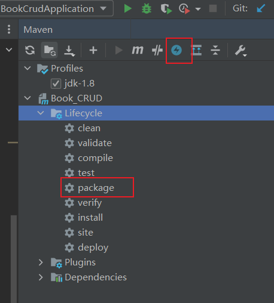

运行 java -jar (target里打包好的jar包)

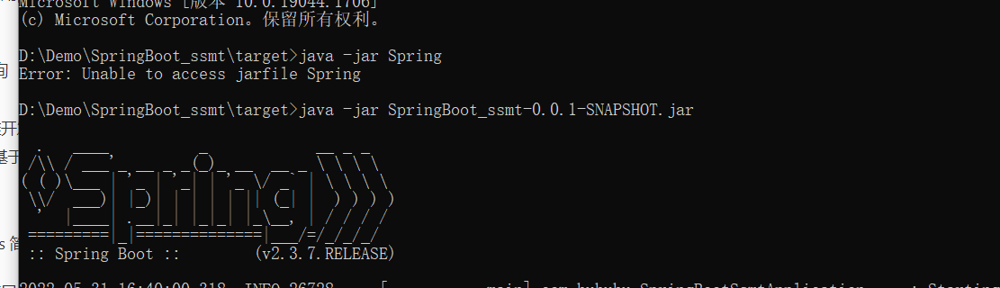

## 可执行jar包目录结构

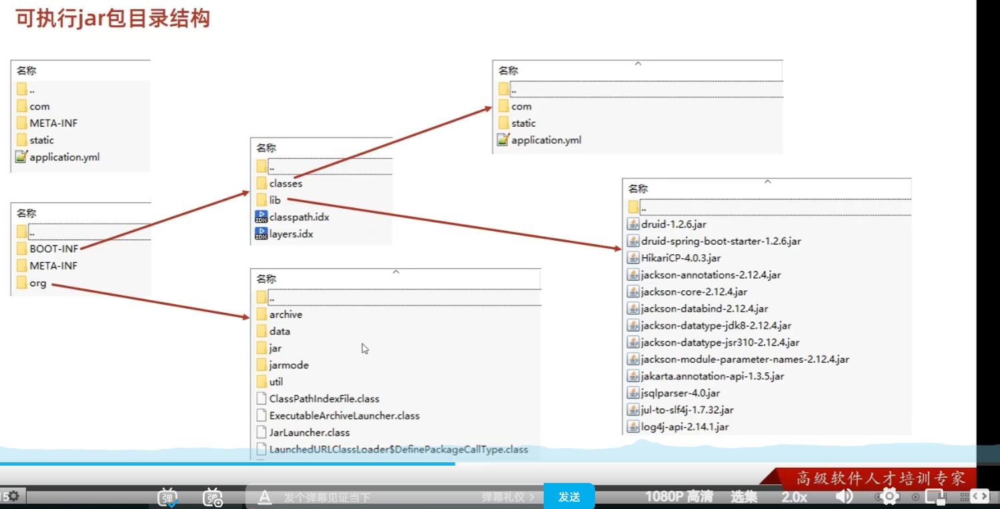

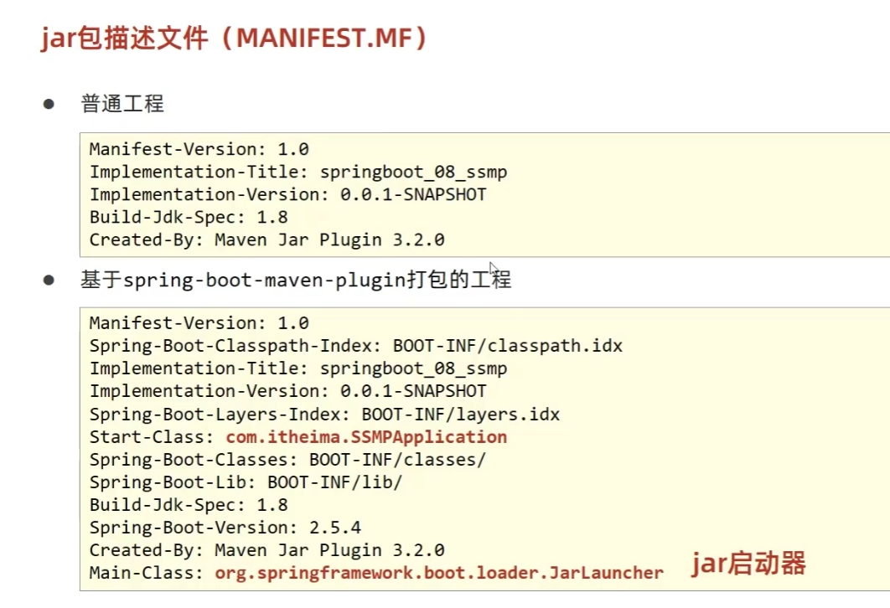

## windos杀死端口


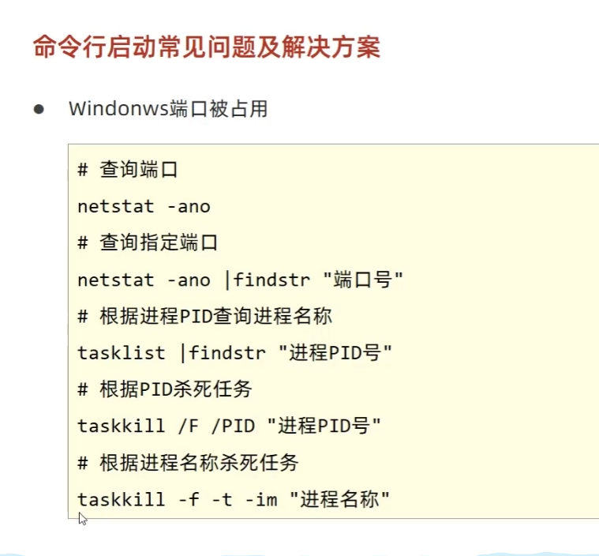

# 上线

>  配置端口
>
>  1.配置文件中配置
>
>  2.运行时命令配置
>
>  3.代码里面配置

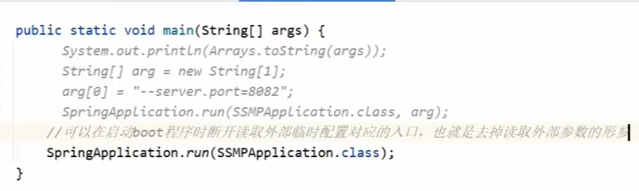

## linux上线

> 安装jdk,mysql,配置数据库,上传jar包,java -jar运行即可

## 配置文件级别

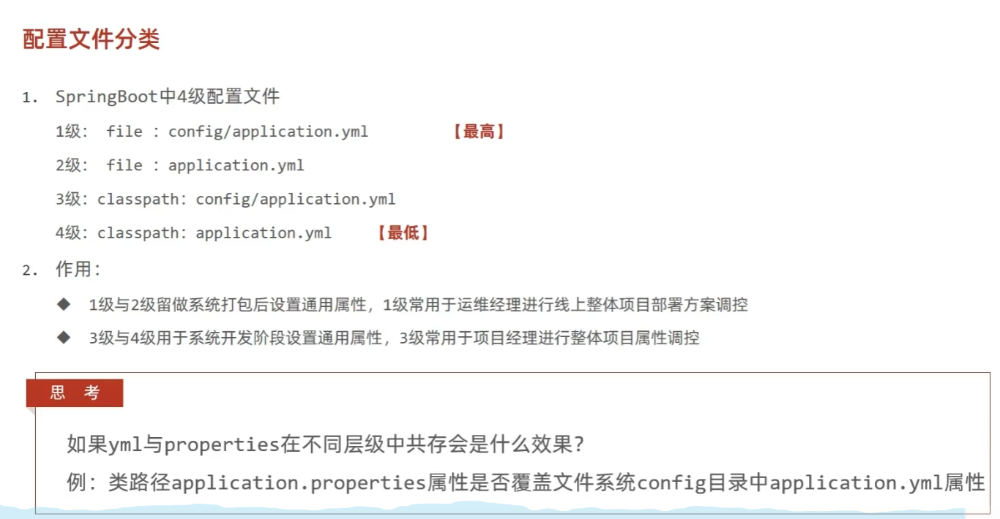

## spring指定配置文件名

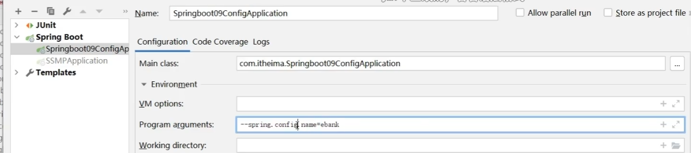

## 多环境开发

> 比如说可以配置链接不同数据库

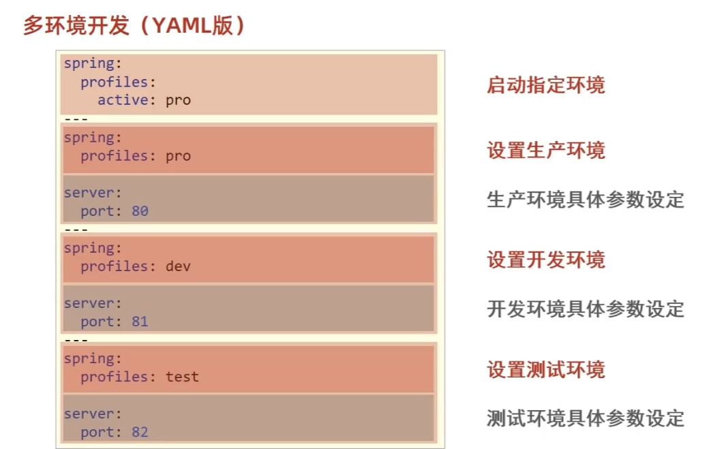


### 配置文件多环境

> 注意环境配置文件要加-<环境>

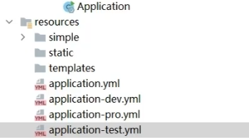

> 使用哪个环境

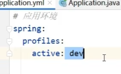

### propertis多文件同上

## 配置组

> group最后运行

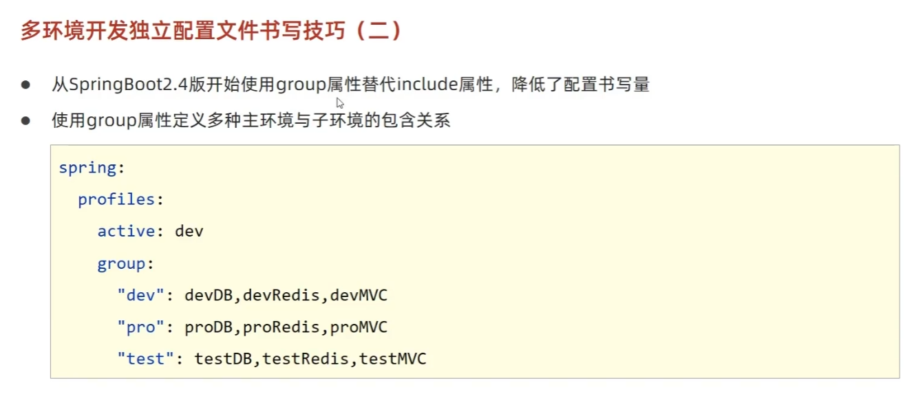

## maven与多环境冲突

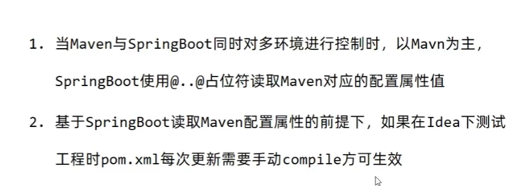